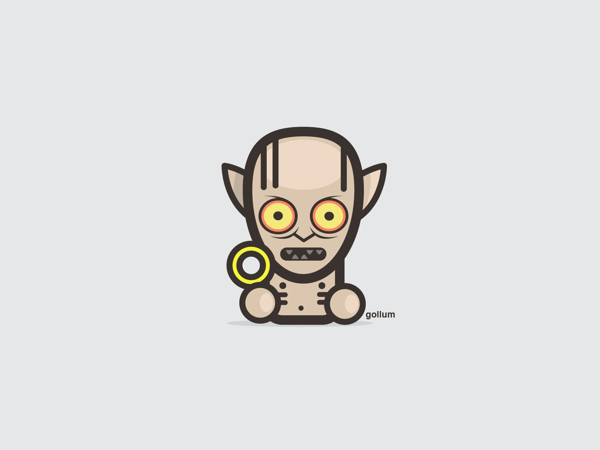

#gollum
yet another android util lib who is living around ugly sides of android world


##How to use

Add the JitPack repository to your build file
```css
  repositories {
      maven {
        url "https://jitpack.io"
      }
  	}
```

Add the dependency in the form
```css
  repositories {
      dependencies {
            compile 'com.github.celepharn:gollum:VERSION'
        }
  	}

  // check out jitpack badge for gollum current version
```